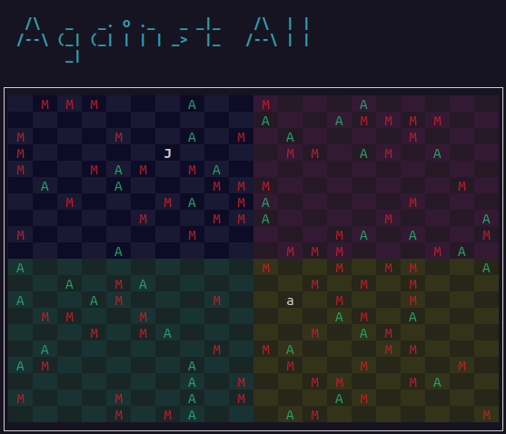

# AGAINST ALL
"Against all" is a distributed multiplayer game.

It is a project for the [Distributed Systems](https://cvnet.cpd.ua.es/Guia-Docente/?wlengua=en&wcodasi=34022&scaca=2022-23) subject at the University of Alicante.

---

## How to use it
Refer to full guide at
[Memoria.md](docs/Memoria.md)

The documentation is written in spanish.

---

Author:  
Javier Mellado Sánchez  
2022-2023