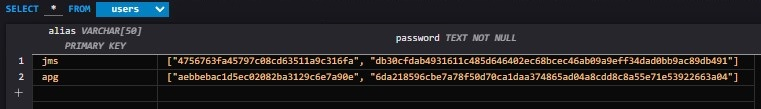
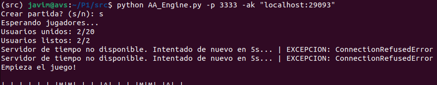
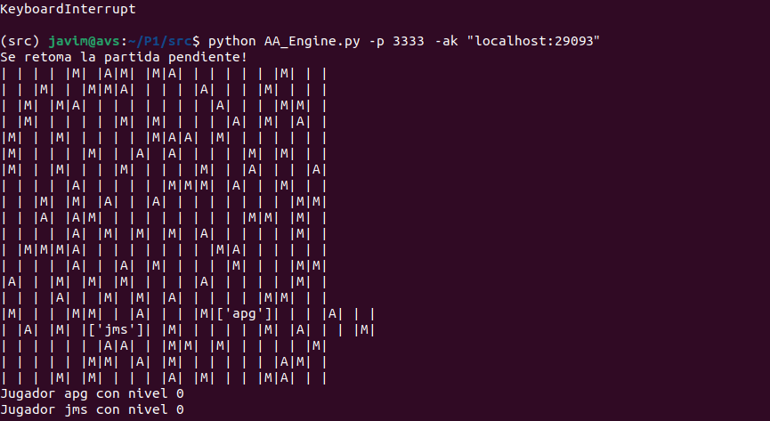

<style>
    .portada{
        text-align: center;
    }
    #asignatura {
        font-size: 15px;
        font-weight: bold;
    }
    #practica {
        font-size: 20px;
        font-weight: bold;
    }
    #titulo {
        font-size: 25px;
        color: lightgreen;
        font-weight: bold;
    }
</style>

<p class="portada" id="asignatura">SISTEMAS DISTRIBUIDOS</p>
<p class="portada" id="practica">- PRÁCTICA 1,2,3 -</p>
<p class="portada" id="titulo">SEGURIDAD Y API REST</p>
<p class="portada">Javier Mellado Sánchez 48800386K</p>
<p class="portada">Universidad de Alicante, 2022-2023</p>

---

<br><br>

# ÍNDICE

- [ÍNDICE](#índice)
- [INTRODUCCIÓN](#introducción)
- [FUNCIONAMIENTO](#funcionamiento)
  - [Registro](#registro)
  - [Partida](#partida)
- [ARQUITECTURA](#arquitectura)
  - [common\_utils](#common_utils)
  - [BASE DE DATOS](#base-de-datos)
  - [KAFKA](#kafka)
  - [OPENWEATHER](#openweather)
    - [COMUNICACIÓN](#comunicación)
  - [AA\_REGISTRY](#aa_registry)
    - [COMUNICACIÓN](#comunicación-1)
    - [PARAMETROS](#parametros)
  - [AA\_ENGINE](#aa_engine)
    - [COMUNICACIÓN](#comunicación-2)
    - [PARAMETROS](#parametros-1)
  - [API\_ENGINE](#api_engine)
    - [COMUNICACIÓN](#comunicación-3)
    - [PARAMETROS](#parametros-2)
  - [AA\_PLAYER](#aa_player)
    - [PARAMETROS](#parametros-3)
  - [AA\_NPC](#aa_npc)
    - [PARAMETROS](#parametros-4)
  - [WEB VIEWER](#web-viewer)
    - [URL](#url)
- [SEGURIDAD](#seguridad)
  - [AUDITORÍA](#auditoría)
  - [CLAVES](#claves)
  - [CIFRADO](#cifrado)
    - [COMUNICACIONES](#comunicaciones)
    - [BASE DE DATOS](#base-de-datos-1)
- [DESPLIEGUE](#despliegue)
  - [CAÍDAS](#caídas)
- [COMENTARIOS](#comentarios)
  - [POSIBLES MEJORAS](#posibles-mejoras)

<br><br>
<!--<div style="page-break-after: always;"></div>-->

# INTRODUCCIÓN

Se implementa un juego distribuido multijugador online "AGAINST ALL".

Los jugadores, humanos o NPCs, se encuentran en un mapa dividido por ciudades y obstaculizado por minas, donde se alimentarán para subir de nivel y así poder matar a otros jugadores.

Cada ciudad tiene su propio clima,
pudiendo variar aleatoriamente hasta 10 puntos el nivel de los jugadores humanos.
- Se sufre efecto frío si Temperatura <= 10ºC.
- Se sufre efecto calor si Temperatura >= 25ºC.

El movimiento en el tablero es libre (N,S,W,E,NW,NE,SW,SE). Además, la geometría es esférica.

El juego acaba cuando termina el tiempo de partida o un jugador se proclama vencedor.

<br><br>
<!--<div style="page-break-after: always;"></div>-->

# FUNCIONAMIENTO

Para poner en contexto los requisitos de la práctica lo mejor es ver funcionamiento del sistema a nivel de usuario.

## Registro

Para que el jugador humano pueda entrar en partida previamente debe ser registrado.

Se tienen las opciones de crear perfil, editarlo y eliminarlo.


<br>

## Partida

El usuario debe iniciar sesión para entrar en la partida.


Una vez validado, tiene que confirmar que está listo para comenzar.


Si la partida aún no ha comenzado, espera a que los demás jugadores estén listos.


Cuando estén todos preparados, la partida se presenta en la pantalla.
El personaje está representado con la inicial de nuestro alias en mayúsculas.


Cada sector, dividido por su color, representa una ciudad.

La partida se controla desde el teclado con:
- Tecla W: (N) Movimiento al norte.
- Tecla S: (S) Movimiento al sur.
- Tecla A: (W) Movimiento al oeste.
- Tecla D: (E) Movimiento al este.
- Tecla Q: (NW) Movimiento al noroeste.
- Tecla E: (NE) Movimiento al noreste.
- Tecla Z: (SW) Movimiento al suroeste.
- Tecla X: (SE) Movimiento al sureste.
- Tecla H: Tabla de clasificación.

Interesa coger el mayor número de alimentos posibles.


Si por desgracia pisa una mina, morirá.


En cualquier momento pueden unirse NPCs.
Tienen un nivel aleatorio fijo establecido inicialmente.
Los alimentos, minas y efectos del clima no les afecta.


Si varios jugadores se encuentran en la misma casilla, luchan.
Gana aquel que tenga más nivel. Si empatan por tener el mismo nivel se quedan en la casilla.

Aunque en los ejemplos sólo hay dos jugadores, puede haber tantos como casillas libres haya en el mapa.

Como hemos visto en las capturas, los jugadores pueden ver la tabla de clasificaciones en cualquier momento, y al terminar su partida, se informa de si has ganado o perdido.

<br><br>
<!--<div style="page-break-after: always;"></div>-->

# ARQUITECTURA

El sistema es distribuido, se modularizan las funciones posibles en servicios.

<br>

## common_utils

Código en [src/common_utils.py](/src/common_utils.py).

Contiene un conjunto de utilidades comunes a todos los módulos para facilitar sus implementaciones.

Se extienden las clases de Kafka y API REST, y se simplifica el manejo de un socket.

<br>

## BASE DE DATOS

Base de datos contenida en el archivo [data/db.db](/data/db.db).

Se ha decidido usar SQLite como motor por la simplicidad de la base de datos y la independencia entre sus tablas.

Existen dos tablas:
- "users": Registro de usuarios.



- gameplay: Variables sobre la última partida.


<br>

## KAFKA

Especificación del docker de kafka en [src/kafka.docker-compose.yml](/src/kafka.docker-compose.yml).

Kafka puede verse como una cola de mensajes de baja latencia masivamente escalable.

Como cliente en Python se ha usado [kafka-python](https://pypi.org/project/kafka-python/).
Hay unos métodos del consumidor necesarios pero no implementados, definidos en [common_utils.py](#common_utils):
- **sync()**: necesario para el correcto funcionamiento del consumidor.
- **consume_topic()**: necesario en el Engine para descartar movimientos de previas partidas no terminadas.
- **last_kafka_msg()**: necesario en el NPC para obtener el ultimo mapa si su movimiento es inteligente.

El problema es que dependen del timeout del poll, que depende a su vez de la máquina utilizada. Un valor de 1s da buenos resultados.

<br>

## OPENWEATHER

Servicio externo online que proporciona el tiempo.

Se solicitan los climas a través de su API.
Clave para utilizarla en [keys/openweather.key](/keys/openweather.py).

### COMUNICACIÓN
```
GET -> "https://api.openweathermap.org/data/2.5/weather?appid={key}&units={units}&q={city}"
```

<br>

## AA_REGISTRY

Código en [src/AA_Registry.py](/src/AA_Registry.py).

Servicio para el manejo de registros.

Se queda a la escucha, por sockets y API REST, de que se haga una solicitud sobre un usuario (registro).

- Por sockets corriendo en el hilo principal.
- API REST corriendo en un hilo nuevo.

La solicitud puede resultar en la creación de un perfil, en su edición o eliminación,
toda acción repercutida sobre la base de datos.
Devuelve un texto informando la resolución de la solicitud.

### COMUNICACIÓN

```
- WITH SOCKETS:
*Se establece la comunicación*
client.send_msg("Create"|"Update"|"Delete")
client.send_obj(("user","password"))
if Update:
    client.send_obj(("newuser","newpassword"))
client.recv_msg() -> MSGOPRE

- WITH APIREST:
POST <- body{"alias":alias, "password":password} -> MSGOPRE
PATCH <- body{"alias":alias, "password":password, "newalias":newalias, "newpassword":newpassword} -> MSGOPRE
DELETE <- body{"alias":alias, "password":password} -> MSGOPRE
```

### PARAMETROS
`args: <sock_port> <api_port>`

<br>

## AA_ENGINE

Código en [src/AA_Engine.py](/src/AA_Engine.py).

Servicio para el manejo del juego.

Se queda a la escucha, por sockets, de que se haga el inicio de sesión de un usuario, devolviendo un texto informando de si ha podido unirse a la partida.
En caso afirmativo, el usuario pasa a ser un jugador de la partida, y la conexión se mantiene.

Puede recibir un mensaje de que el jugador está listo;
pero si, mientras no haya sido enviado, el usuario cierra la conexión, se descarta de la partida.
Una vez que todos los usuarios están listos (al menos 2 personas), la partida comienza.
En este punto se acaba la autenticación, los sockets son cerrados, no se volverán a utilizar.

Se crea una nueva partida si la anterior acabó.
El mapa es creado aleatoriamente, y los climas son solicitados al servicio OPENWEATHER.

Comienza la comunicación a través de una cola Kafka.
Inicialmente se envía el mapa a todos los jugadores.
Durante toda la partida, el Engine consume los movimientos de los jugadores (el tópico "move"), donde la clave es el alias de quien ha movido y el valor la dirección, y se procesa en el juego.
Acto seguido se envía el nuevo mapa resultante (al tópico "map") a todos los jugadores como valor, indicando el alias de quien ha hecho el movimiento en la clave.
Todos los nuevos datos de la partida son guardados en la base de datos.

Se tiene en cuenta que en cualquier momento un NPC puede unirse a la partida.
Además, si la duración de la partida ha superado el tiempo estipulado, en lugar de un nuevo mapa, se envían los ganadores.

Al terminar la partida, da la opción para empezar otra.

Para una mayor compresión bastaría con ver el bucle principal:
```python
while True:
    msg = consumer.poll_msg()
    if msg:
        consumer.commit()

        playeralias, direc = msg.key, msg.value

        if direc == ".":
            if not game.inProgress():
                continue
            print("NPC unido")
            game.newRandPlayer(NPC(playeralias))
        else:
            print(playeralias, "se mueve en la direcion", direc)
            res = game.move(playeralias, Direction.fromStr(direc))
            if not res:
                continue

        print(game)
        producer.send("map", key=playeralias, value=game.getMap())
        game.store(FDATA_DB)

        if game.isEnded():
            break

    if game.getTime() >= GAME_TIMEOUT:
        producer.send("map", key="end", value={"winners":[p.alias for p in game.getWinners()]})
        print("Se agoto el tiempo")
        break
```

### COMUNICACIÓN
```
*Se establece la comunicación*

- FOR PLAYER
client.send_obj(("user","password"))
client.recv_msg() -> MSGOPRE
client.send_msg("Ready")
client.with_kafka.recv() -> "start": Initial Map

- FOR NPC
client.with_kafka.send("alias": ".")
client.with_kafka.recv() -> "alias": Map

thread1:
    while move:
        client.with_kafka.send("alias": "direction")
thread2:
    while any player move:
        client.with_kafka.recv() -> "anyalias": Map
    if timeout:
        client.with_kafka.recv() -> "end":{"winner:[anyalias,]"}
```

### PARAMETROS

`args: -p <port> -ak <kafka-ip>:<kafka-port(29093)>` \
`extras: -ms <mapsize> -mp <maxplayers> -t <gametimeout>`

<br>

## API_ENGINE

Código en [src/API_Engine.py](/src/API_Engine.py).

Servicio API REST del estado del juego.

Únicamente expone los datos necesarios para obtener una información básica de la partida:
el estado, el mapa, y los jugadores {alias, alive, level, pos}.

### COMUNICACIÓN
```
GET [/status] -> status
GET [/game] -> map
GET [/players] -> players -> [{"alias":alias,"level":level},...]
GET [/] -> map + players -> {"map":map, "players":players}
```

### PARAMETROS

`args: <port>`

<br>

## AA_PLAYER

Código en [src/AA_Player.py](/src/AA_Player.py).

Cliente de un jugador.

Puede comunicarse con Registry o Engine. A Registry puede hacerlo por los dos tipos de comunicación.

No es necesario explicar cómo funciona, su comunicación es inversa a la de los dos servicios.
Y la interacción con el usuario puede verse en el apartado de [funcionamiento](#funcionamiento).

La interfaz gráfica se ha hecho utilizando curses, una librería de control de terminal que permite la construcción de aplicaciones de interfaz de usuario de texto (TUI).

Para una mayor compresión bastaría con ver el bucle principal:
```python
while True:
    time.sleep(TIMEREFRESH)

    key = self.screen.getch()

    if key == ord("h"):
        self.drawLeaderboard()
        continue

    direc = PlayerGame.keyToDirec(key)
    if direc is not None:
        self.producer.send("move", key=self.username, value=direc)

    msg = self.consumer.poll_msg()
    if msg:
        if msg.key == "end":
            self.drawGameOver(self.username in msg.value["winners"])
            break

        newmap = msg.value
        self.setMap(newmap)

        if self.isEnded():
            self.drawGameOver(self.isAlive())
            break
```

### PARAMETROS

`args: -ar <AA_Registry-ip>:<AA_Registry-port> -ae <AA_Engine-ip>:<AA_Engine-port> -ak <kafka-ip>:<kafka-port(29093)>` \
`extras: -ms <mapsize>`

<br>

## AA_NPC

Código en [src/AA_NPC.py](/src/AA_NPC.py).

Cliente de un NPC.

Se comunica directamente con Engine, sin necesidad de autenticarse.
Para ello, envía a la cola un mensaje de su unión.
Espera a recibir un mapa de vuelta, al que pertenecerá.
Desde ese momento su partida comienza.

Cada cierto tiempo, consume el último mapa, y hace un movimiento.
El movimiento depende del tipo de NPC especificado:
- Normal: Los movimientos son aleatorios.
- Agresivo: Los movimientos son inteligentes.
  Detecta al jugador más cercano que puede matar y se dirige hacia él.
  Si ninguno es detectado, el movimiento es aleatorio.

Para una mayor compresión bastaría con ver el bucle principal:
```python
while True:
    '''
    Between the wait of time.sleep() there can be several moves
    only want the last one
    '''
    msg = self.consumer.last_kafka_msg()
    if msg:
        if msg.key == "end":
            break

        self.actualmap = msg.value

    if self.isEnded():
        break

    direc = self.doDirec()
    print("Se mueve:", direc)
    self.producer.send("move", key=self.username, value=direc)

    time.sleep(SLEEPTIME)
```

### PARAMETROS

`args: -ak <kafka-ip>:<kafka-port(29093)>` \
`args extras: -t type> -s sleeptime>`

<br>

## WEB VIEWER

Código en [src/webviewer/](/src/webviewer/).

Cliente WEB visor del juego.

La página consta del tablero del juego y la tabla de clasificaciones.

La forma más sencilla de hacerlo es usando los tres principales elementos del front de una página web:
- HTML: Lenguaje de marcado para la interfaz
- CSS: Lenguaje de estilos para la interfaz
- JAVASCRIPT: Lenguaje de programación para dotar de funcionalidad la interfaz.

Cada segundo, se realiza una solicitud de todos los datos a la API,
y se actualizan los elementos de la página.
Solo muestra información si hay una partida en curso.

Tener que distribuir el proyecto web a cada usuario no es práctico. Se comenta en el apartado de [despliegue](#despliegue).


### URL

`index.html?addr=https://<API_Engine-ip>:<API_Engine-port>`

<br><br>
<!--<div style="page-break-after: always;"></div>-->

# SEGURIDAD

## AUDITORÍA

Para el servicio Registry es indispensable conocer los registros que se realizan.

En [data/registry.log](/data/registry.log) hay un ejemplo.

Hay constancia de la operación, con sus propiedades (fecha,hora,direccion), y la acción tomada si al final es aceptada.

<br>

## CLAVES

Claves utilizadas en [keys/](/keys/).

Bastaría con crear una clave privada y un certificado autofirmado.

```
openssl req -x509 -newkey rsa:4096 -nodes -days 36500 -subj "/C=ES/ST=Alicante/L=Alicante/O=UA/OU=SD/CN=jms138.ua" -out cert.pem -keyout key.pem
```

Para kafka, es recomendable utilizar un almacén de claves y certificados JKS.

```
keytool -genkey -keyalg RSA -ext san=dns:localhost,ip:127.0.0.1 -alias selfsigned -storepass jms138 --keypass jms138 -validity 36500 -dname "CN=localhost, OU=Unknown, O=Unknown, L=Unknown, ST=Unknown, C=Unknown" -keystore keystore.jks
keytool -export -keystore keystore.jks -alias selfsigned -storepass jms138 -file selfsigned.crt
keytool -import -file selfsigned.crt -trustcacerts -alias selfsigned -storepass jms138 -keystore truststore.jks -noprompt
echo "jms138" > keystore_creds
echo "jms138" > truststore_creds
echo "jms138" > key_creds
```

<br>

## CIFRADO

### COMUNICACIONES

Para obviar la configuración de la seguridad en cada módulo, únicamente se amplía la extensión de las clases para las comunicaciones.

***Mykafka/***: Conforme la especificación del docker, bastaría con especificar que el protocolo de seguridad sea SSL y crear un contexto para que no verifique el certificado y máquina.

- Sin cifrado puede verse el mensaje (Protocolo TCP-TLS): \

- Con cifrado está oculto (Protocolo TCP): \


***MySecureSocket***: El contexto SSL permite modificar directamente el socket para obtener uno seguro. En el caso del servidor, al aceptar el cliente, se crea el socket seguro y se le carga la clave y certificado. En el del cliente, al crear su socket, se crea el socket seguro con un contexto que no verifique el certificado y máquina.

- Sin cifrado puede verse el registro (Protocolo TCP-TLS): \

- Con cifrado está oculto (Protocolo TCP): \


***MyFlask/***: Más sencillo, únicamente se pasa la clave y certificado por parámetros.

- Con cifrado el mensaje está oculto (Protocolo TCP-TLS): \


### BASE DE DATOS

En la base de datos existen campos confidenciales que deben ser protegidos ante su robo.

Las contraseñas nunca deben guardarse en texto plano. Aplicar una función Hash asegura que sea muy difícil conocer la contraseña real. Además, aplicando sal a la combinación se añade una capa más de seguridad, lo que asegura que, aunque dos usuarios tengan la misma contraseña, sean almacenadas diferentes y, por lo tanto, a un atacante no le sirva un diccionario de Hashes para adivinar la contraseña.

Para crear una contraseña:
1. Al crear la contraseña se crea un cadena de caracteres aleatorios que servirá como sal.
2. La contraseña se une con la sal, y se genera un Hash de la combinación.
3. El Hash y la sal se guarda, junto con los datos del usuario, en la base de datos.

Para validar un intento de contraseña:
1. Se solicita el Hash y la sal a la base de datos.
2. La contraseña se une con la sal, y se genera un Hash de la combinación.
3. Se compara el Hash de la base de datos con el generado.

```python
def user_correct_login_db(user):
    user_fetch = select_user_db(user.alias)
    if user_fetch is None:
        return False
    salt, hash = user_fetch.password
    return hash == hashpasswd(user.password, salt)[1]
```

<br><br>
<!--<div style="page-break-after: always;"></div>-->

# DESPLIEGUE

El sistema se ha escrito en Python, un lenguaje interpretado, por lo que no es necesaria la compilación para el despliegue.
Si bien, hay que contar con todas las dependencias para poder ejecutar cada módulo.
Se ha especificado un entorno virtual en [src/Pipfile](/src/Pipfile) para instalar todas las dependencias en sus respectivas versiones.

El intérprete de Python debe estar instalado, con el gestor de paquetes pip, y el módulo pipenv.
```
# Install pipenv if you do not have it
pip install pipenv

# Install dependencies
pipenv install

# Start pipenv environment
pipenv shell

# Service/client help
python <service>.py -h

# Run service/client
python <service>.py <params...>
```

- Para cada servicio hay que especificar el puerto de escucha.
- Para cada cliente hay que especificar a qué puerto se conectará.
- Puede ser que un servicio sea además un cliente de otro servicio, como es el caso con el Engine.

Para desplegar Kafka, al ser un servicio de terceros, hay que cumplir con sus requisitos, que pueden variar según el sistema.
Para evitarlo se ha dockerizado, de tal forma que sólo se necesita instalar docker y docker-compose.

De igual manera, podría haberse servido un docker para cada servicio, pero realmente el sistema no es difícil de desplegarlo como para necesitarlo.

El webviewer puede usarse abriendo el archivo HTML en el navegador, o creando un servidor web con la página.
Con docker es muy sencillo desplegar un servidor nginx. Especificación en [src/webviewer.dockerfile](/src/webviewer.dockerfile). Se necesita un visor web como Firefox/Chrome/Edge para visualizar el webviewer.

El sistema ha sido probado en Windows y Linux.
Evidentemente, el jugador necesita una terminal que soporte curses.

Ejecución básica de cada módulo:


Todo ha sido desplegado en la misma máquina, un desaprovecho del poder distributivo que tiene el sistema.
Podemos probarlo de forma distribuida de las siguientes maneras:
- En una red privada:
  - Podríamos conectarnos desde distintos ordenadores en una LAN.
  - Podríamos simular lo anterior configurando una VPN (red privada virtual). Por ejemplo, con [Hamachi](https://vpn.net/).
- En Internet:
  - Con servidores, abriendo los puertos a Internet.
  - Podríamos simular el redireccionamiento del localhost a Internet. Por ejemplo, con [ngrok](https://ngrok.com/).

Habría que cambiar la dirección localhost por la IP (privada o pública respectivamente) de la máquina.

Si tuviéramos el *escenario físico mínimo para el despliegue de la práctica* según el enunciado de la práctica:
- PC1 [192.168.56.11]
```bash
#! Cambiar en kafka.docker-compose.yml "localhost" por "192.168.56.11"
$ sudo docker-compose -f kafka.docker-compose.yml up
$ sudo docker run --name webviewer -p 8080:80 webviewer
$ python AA_Player.py -ar "https://192.168.56.12:2220" -ae "192.168.56.12:3333" -ak "192.168.56.11:29093"
# navegador_web >> http://192.168.56.11:8080/?addr=https://192.168.56.12:4444
```
- PC2 [192.168.56.12]
```bash
$ python AA_Engine.py -p 3333 -ak "192.168.56.11:29093"
$ python API_Engine.py 4444
$ python AA_Registry.py 2222 2220
```
- PC3 [192.168.56.13]
```bash
$ python AA_Player.py -ar "https://192.168.56.12:2220" -ae "192.168.56.12:3333" -ak "192.168.56.11:29093"
$ python AA_Player.py -ar "https://192.168.56.12:2220" -ae "192.168.56.12:3333" -ak "192.168.56.11:29093"
$ python AA_NPC.py -ak "192.168.56.11:29093"
```

<br>

## CAÍDAS

Si un módulo se cae, no interrumpe bruscamente la ejecución de los demás. Se informará o se esperará a que el módulo sea nuevamente recuperado.

Pueden pasar las siguientes situaciones:
- Engine si OPENWEATHER está inactivo: Se le informa y espera a que se recupere. Pero es muy raro que ocurra, es un servicio estable continuo.\

(Ejemplo de la práctica anterior)
- Engine si Kafka está inactivo: Nunca será el caso. Falla antes el Player, el Engine no puede llegar al punto de crear partida.
- Engine si Kafka no responde: No se reciben nuevos movimientos. No interrumpe nada.

- Player si Registry está inactivo: Se le informa. \

- Player si Engine está inactivo: Se le informa. \


- Player o NPC si Engine no responde: No se reciben nuevos mapas, descartando los movimientos. No interrumpe nada.
- Player o NPC si kafka no está activo: No se reciben ni envían nuevos mapas. No interrumpe nada.
- WEB viewer si la API REST no está activa:


- Módulos correspondientes si la base de datos no existe: Al comienzo de cada uno se comprueba, si es así, es creada.

Cada módulo caído se recupera fácilmente ejecutándolo de nuevo.

En el caso del Engine, la partida perdida debe ser recuperada;
por ello, en cada movimiento, es guardada en la base de datos.
De tal forma que si, al crear partida, se comprueba que existe una en curso guardada, se recupera.




El resultado es un sistema resiliente, con manejo de fallos y fácilmente recuperable.

<br><br>
<!--<div style="page-break-after: always;"></div>-->

# COMENTARIOS

Ha sido una práctica muy larga, pero el tiempo ha sido aprovechado.
Si bien el lenguaje de programación ya lo manejaba muy bien, se ha enfocado mucho en la lógica de llevar a cabo la partida,
y sobre todo, cómo combinar la de cada módulo por medio de conexiones. Es satisfactorio ver la sinergia de todo.

A partir de una especificación, se ha creado un sistema recorriendo cada fase del proyecto. No ha sido tarea fácil, pero se asemeja a un desarrollo real.

La práctica motiva a terminarla con un buen acabado al tratarse de una aplicación divertida y funcional fuera del contexto de la asignatura.

## POSIBLES MEJORAS

Algunas mejoras que aún pueden realizarse son:
- Avisar en el cliente cuando el Engine o Kafka ha caído.
- Descartar movimiento cuando Kafka ha caído.
- Utilizar un lenguaje compilado para los módulos cliente, así se facilita su distribución.

- Evitar un ataque con SQL injector.
- Autenticación en Kafka.
- Evitar que un atacante mueva a un jugador.
  - *Problema*: El engine mueve a un jugador por su alias, orden enviada del jugador por kafka
      Entonces un atacante podría mover a un jugador enviando el movimiento a kafka con el alias del jugador afectado.
  - *Solución*: En la autenticación por sockets para comenzar la partida
      En lugar del "ready", el jugador podría finalizar la conexión pasándole un texto aleatorio.
      De tal forma que únicamente el engine y el jugador conocen el id con el que se le reconoce para moverse.
      Podría ser de la misma forma con la que se le reconoce a los NPCs.
      Del Engine no debería haber una salida que exponga el id, tanto para jugadores como NPCs